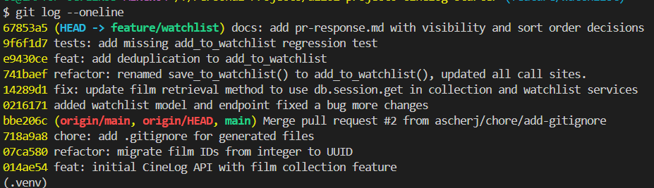

# PR Response Doc — CineLog Watchlist Feature

## AI Usage

I used AI during the review cycle in two ways. First, I asked it to act like a careful reviewer for Comments 4 and 5 so it could surface counterarguments or tradeoffs I had not yet acknowledged. That helped me stress-test the reasoning behind my final position. I also used AI to help format and reword the text in this PR response so it read more clearly and concisely, while keeping the substance of my original ideas. The final wording is my own, but AI helped tighten the phrasing and presentation.

## Comment 1 — Rename

**What I did:**
I renamed the watchlist service function from **save_to_watchlist()** to **add_to_watchlist()** in [services/watchlist_service.py](services/watchlist_service.py) and updated the one route call site in [routes/watchlist/watchlist.py](routes/watchlist/watchlist.py) to use the new name. I then used VSCode's 'all references' search to confirm the old symbol name was no longer referenced anywhere in the codebase.

**How I verified:**
I checked the rename by searching the workspace for the old function name and confirming the only remaining call path used the new API name. After the rename, I reran the full test suite with `pytest tests/ -v`, which completed successfully with all tests passing.

## Comment 2 — Deduplication

**What I did:**
I added the duplicate-protection logic to **add_to_watchlist()** so it follows the same pattern as **add_to_collection()** in [services/collection_service.py](services/collection_service.py). The new behavior checks whether a `WatchlistEntry` already exists for the same `user_id` and `film_id`, and if so it raises **AlreadyInWatchlistError** instead of creating a duplicate record.

**How I verified:**
I used the collection service as the reference implementation and mirrored its guard pattern: query for an existing row, short-circuit on a match, and return a clear domain error rather than letting the database create a duplicate. After the change, I verified the suite still passed by running `pytest tests/ -v`, which reported all tests passing.

## Comment 3 — Missing test

**What I did:**
I added a new regression test file, [tests/test_watchlist.py](tests/test_watchlist.py), modeled on [tests/test_collection.py](tests/test_collection.py), specifically mirroring `test_add_to_collection_nonexistent_film_raises` for the watchlist path. The test uses the same app fixture pattern, creates a sample user, and asserts that `add_to_watchlist()` raises `FilmNotFoundError` when passed a non-existent film ID.

**How I verified:**
I used the same fixture and assertion structure from [tests/test_collection.py](tests/test_collection.py) as the template, then ran `pytest tests/test_watchlist.py -v` to confirm the new test is collected and passes once the file exists. I also reran `pytest tests/ -v` to confirm the rest of the suite still passes.

## Comment 4 — Default visibility

**My position:**
I’m keeping the default watchlist visibility at `public=True`.

**Reasoning:**
For CineLog, that matches the most common expectation for a user-generated list: a new list should be visible by default unless the user explicitly opts into privacy. That is the behavior users are used to from other media platforms, where sharing is the norm and privacy is a deliberate override. In practice, that reduces friction for the common case: a user adds a watchlist entry and expects it to be discoverable and shareable without needing to remember to change a setting first. It also fits the product’s social/usefulness model better than forcing every user to make an extra privacy decision up front.

**Tradeoff acknowledged:**
The tradeoff is that this makes privacy less frictionless for users who want a private list by default. That is a real downside, but in this product context I still think the default should remain public because it better matches established playlist conventions and avoids making the default interaction more cumbersome for the majority of users.

## Comment 5 — Sort order

**My position:**
I agree with the maintainer’s preference and would default the watchlist to date-added order.

**Reasoning:**
The main user need here is recency: when someone adds a film to their watchlist, they usually want to see it immediately in the place they just interacted with. Date-added order reflects the “most recently saved” mental model, which is the most reliable and least surprising view for a personal list. Alphabetical order can be useful for browsing, but it is a weaker fit for a list that is primarily a working queue of things a user is trying to remember or act on.

**Engagement with reviewer's point:**
I agree with the reviewer’s framing that most users are not trying to browse an alphabetized archive when they return to a watchlist. A fresh add should remain visible at the top of the list, which makes the interaction feel immediate and reduces the chance that a newly added film is lost in a longer list. That said, alphabetical order still has value as a secondary or optional sort mode, but it should not be the default for the main watchlist experience.

## Comment 6 — Rebase

**What happened:**
The rebase itself proceeded cleanly. The only wrinkle was a local untracked `.gitignore` file that Git warned would be overwritten during the checkout step, so I moved it out of the way before retrying the rebase.

**How I verified no conflict remains:**
After retrying, Git reported `Successfully rebased and updated refs/heads/feature/watchlist`, which confirms the branch was replayed cleanly onto the latest `main` without any merge conflicts. I also confirmed the branch history remains linear after the rebase.

## PR Description

This PR adds a watchlist feature to CineLog and introduces the core endpoints and service logic for saving films for later viewing. Users can retrieve their watchlist and add films to it through the watchlist API, while the service layer enforces the expected business rules around missing films and duplicate entries.

Design decisions:

1. Visibility default: the watchlist defaults to `public=True` because that matches the most common user expectation for a newly created list and reduces friction for the standard “shareable by default” workflow. Privacy remains a deliberate user choice rather than a required setup step.
2. Sort order: the watchlist is ordered by date added rather than alphabetically so that the most recently saved film appears first. This aligns with the user’s working-memory model of a queue and makes newly added items easy to confirm immediately.

Manual testing steps:

1. Start the app with `python app.py` or the project’s normal Flask run command.
2. Create or identify a user ID and a film ID that exists in the database.
3. Send a `POST` request to `/watchlist/<user_id>/add` with JSON like `{ "film_id": <film_id> }` to add a film to the watchlist.
4. Confirm the response returns a `201` status and the newly created watchlist entry.
5. Send a `GET` request to `/watchlist/<user_id>` to confirm the watchlist is returned and items are displayed in date-added order.
6. Try adding the same film twice to confirm the service raises the expected duplicate-handling error rather than silently creating a second entry.
7. Try adding a nonexistent film ID to confirm the service raises `FilmNotFoundError`.
8. Run `pytest tests/ -v` to confirm the full test suite still passes.
